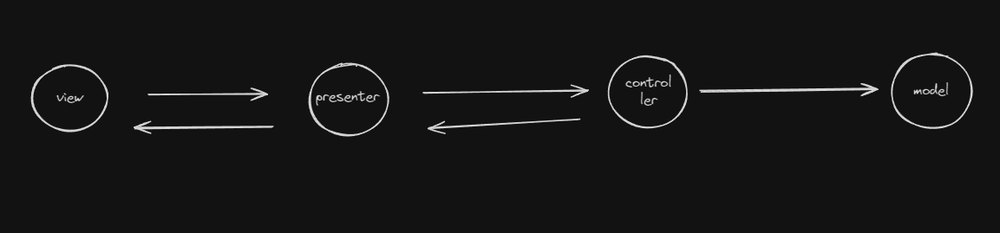

# Desafio 3 - Consultório + Banco de dados

Este desafio foi desenvolvido para simular um gerenciador de consultas, feito para a residência de Software da iUUL.
Sua estruturação conta com um padrão de arquitetura MVP/MVC:


E também fiz mudanças para fazer operações sobre um banco de dados postgres.

## Como usar

1. Clone o repositório para sua máquina local.
2. Configure o arquivo .env com as informações do seu banco de dados (como usuário e senha).
2. Instale as dependêcias do projeto com o comando: ```npm install```
3. Inicie o projeto por meio do comando: ```npm run dev```

obs: Deixei o .env no código para fins de correção.


